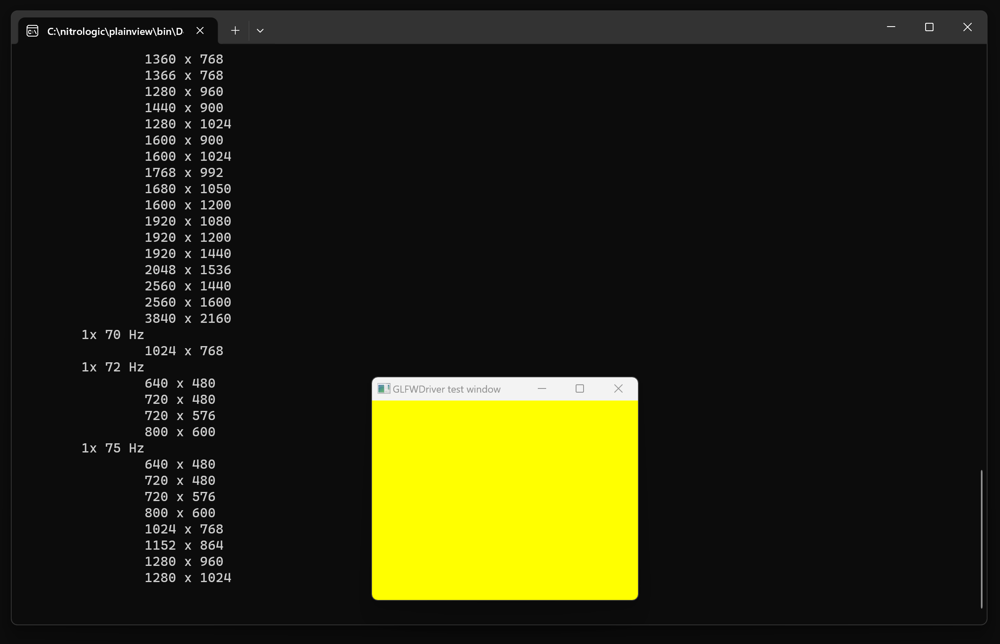

# plainview

a plain view of the modern monitor video display landscape

## Window manager evaluation

### SDL 3

* no display names
* CVDisplayLink support for MacOS
* reports 1x and 2x pixel densities per video mode

### GLFW 3

* correct monitor names
* no CVDisplayLink support
* no pixel density encoded in video mode

## Latest

## Credits

GLFW3 3.4.0
Copyright (c) 2002-2006 Marcus Geelnard
Copyright (c) 2006-2019 Camilla Löwy 

SDL 3.0
Copyright (C) 1997-2023 Sam Lantinga
