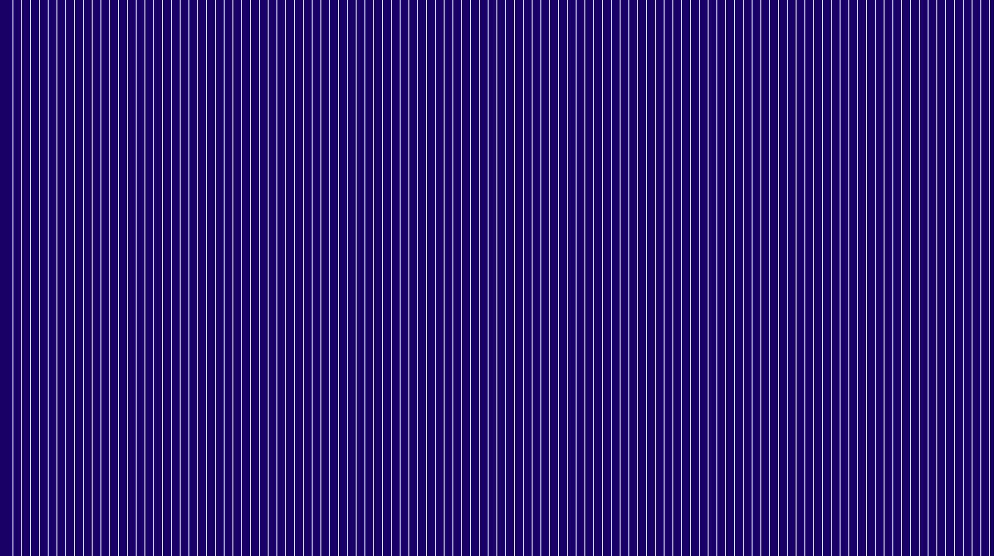

# plainview

A plain view of the modern monitor video display landscape

	* display device management courtesy SDL3 
	* OpenGL bindings courtesy Glad Loader-Generator 

# Latest

	* github workflow added for macos ubuntu windows
	* a proprietary GL3Engine implementation
	* an SDL_CocoaOpenGL movedToNewScreen patch - see notes.txt for application
	* support for GLFW 3 removed
	* big ups to SDL3 for managing OpenGL 3.2 GLSL 3.30 so well

# Coming Soon

	* some box2d experiments 
	* vector font
	* remote host 1

# Gallery

# dependencies

## WSL:Ubuntu

sudo apt update && sudo apt upgrade

sudo apt install g++ gdb make cmake

sudo apt install libcurl4-openssl-dev

sudo apt install gcc-arm-none-eabi

## Credits

SDL 3.0
Copyright (C) 1997-2023 Sam Lantinga

box2d 2.4.1
Copyright (c) 2019 Erin Catto
